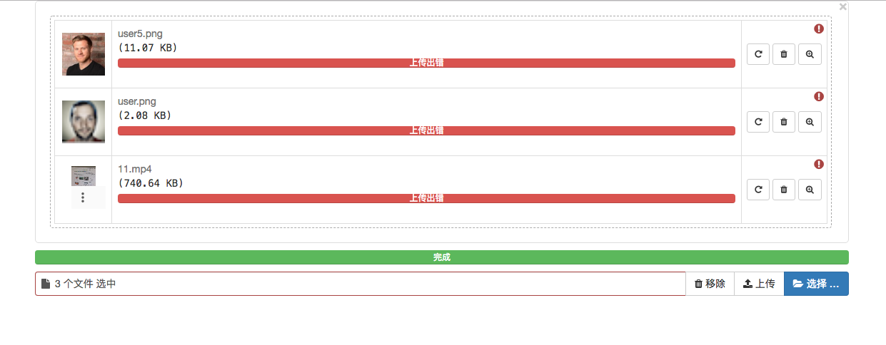
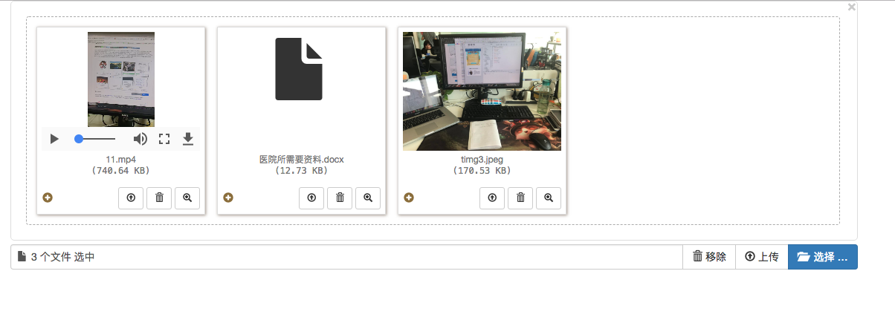
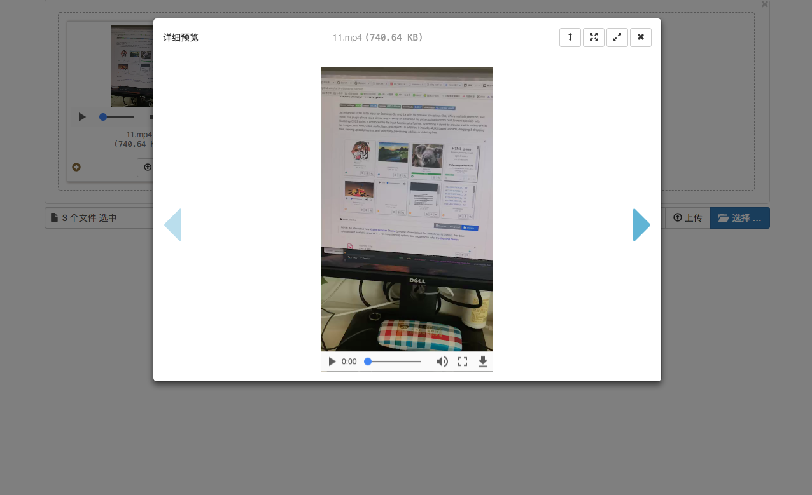

# bootstrap-file-upload
基于bootstrap的文件上传效果，支持bootstrap.3.3.X以上

## 效果图：

## 简要：
* bootstrap-fileinput是一款基于Bootstrap 3.x的HTML5文件上传插件。该文件上传插件带有预览图效果，可同时选择多个文件。
* 该文件上传插件比普通的文件上传插件功能更强大，它可以对图片、文本文件、HTML文件、视频文件、音频文件、flash文件生成预览图。另外，它还可以基于AJAX上传文件，拖拽上传文件，查看上传进度，可以选择性的预览，添加或删除文件。

## 插件外部依赖需求：
* Bootstrap 3.x
* 最新版本的jQuery
* 大多数现代浏览器都支持HTML5（inputs和FileReader AP），CSS3和jQuery。对于IE浏览器，必须是IE10以上的版本。IE9及以下的版本会回退为普通的文件上传组件，并且不支持选择多个文件和HTML 5 FileReader API。
* AJAX上传需要浏览器支持HTML5 FormData和XHR2 (XMLHttpRequest 2)。大多数现代浏览器都支持FormData和XHR2。在不支持这些特性的浏览器中将会回退为普通的文件上传组件。

## 官方仓库：
* https://github.com/kartik-v/bootstrap-fileinput
